# Изучение работы хеш-таблицы и её оптимизация
Хеш-таблица - это такая структура данных, которая позволяет быстро вставлять, искать и удалять элементы.

Допустим, мы хотим вставить элемент в хеш-таблицу. Ячейка, в которую надо вставить элемент определяется при помощи хеш-функции. Хеш-функция получает на вход элемент, а на выход выдает присвоенный элементу номер. Это число и будет определять ячейку, в которую отправится элемент.

<div align="center">
  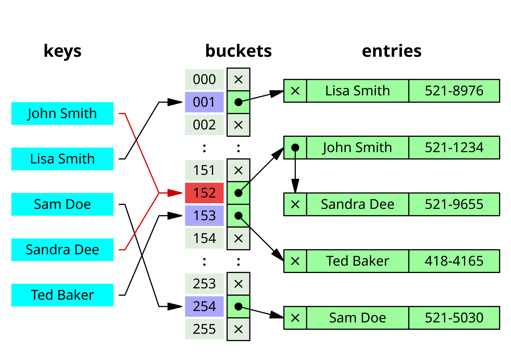
  <br>
  <sub>Умная картинка из википедии для привлечения внимания</sub>
</div>

## Как устроена моя хеш-таблица:

Ячейками являются односвязные списки, в которых хранятся уникальные английские слова. Перед тем, как вставить элемент, программа проверит, есть ли он в таблице, и повторно вставлять не будет.   
Хеш-функции могут возвращать числа, превосходящие размер хеш-таблицы, но это не беда, номер ячейки будет являться остатком от деления значения хеш-функции на размер хеш-таблицы. (Кстати ровно по этой причине в качестве размера хеш-таблицы следует брать простое число - слова будут более равномерно распределяться по хеш-таблице).  
В большинстве измерений размер хеш-таблицы = 4421, это для того, чтобы load factor (среднее количество слов в ячейке) был не очень большим (~7) (чтобы быстрее искать слова).  

## Обзор хеш-функций
1) Return0 - возвращает 0 всегда
2) FirstLetterOfWord - возвращает ASCII-код первой буквы слова
3) ReturnLenOfWord - возвращает длину слова
4) ReturnASCIISum - возвращает сумму ASCII-кодов букв слова
5) RotateLeft - циклический сдвиг влево
6) crc32 - алгоритм такой есть

## Return0()

Нетривиально, возвращает [0](https://ru.wikipedia.org/wiki/%D0%9D%D0%BE%D0%BB%D1%8C)  

```
unsigned int Return0(char* word)
{
    return 0;
}

```

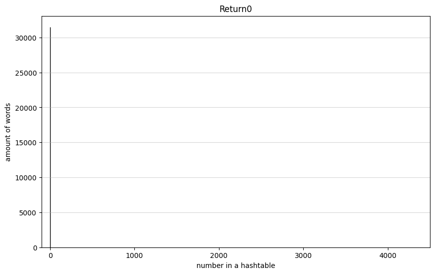

Такая себе хеш-функция, весь прикол хеш-таблицы теряется, она выглядит как обыкновенный список. Дисперсия = 31500  

## FirstLetterOfWord()
Возвращает ASCII-код первой буквы слова  

```
unsigned int FirstLetterOfWord(char* word)
{
    return word[0];
}
```
На полном размере таблицы плохо видно распределение, зато заметно, какую маленькую часть таблицы мы используем.  

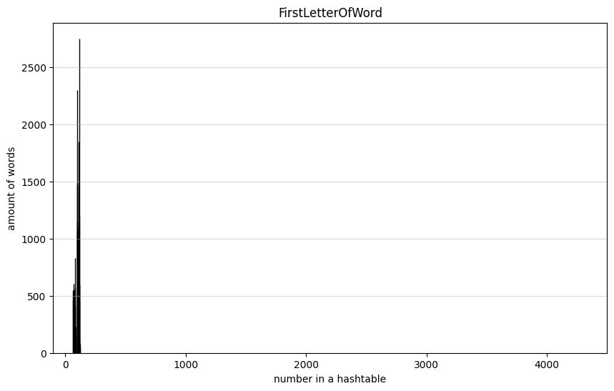

.png)

Это, конечно, получше, чем Return0(), но, как будет видно дальше, есть и поинтереснее решения. Дисперсия = 1156  

## ReturnLenOfWord()
Возвращает длину слова.  
```
unsigned int ReturnLenOfWord(char* word)
{
    return strlen(word);
}
```
Опять разброс значений маловат. Дисперсия = 3471  

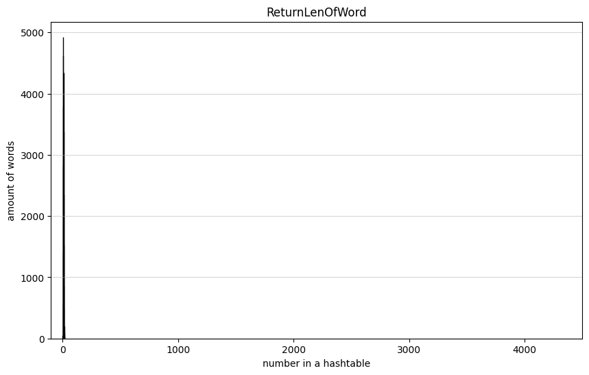

.png)

Не идеально, люди не используют слова, длина которых достигала бы размера нашей хеш-таблицы, а жаль.  

## ReturnASCIISum()
Возвращает сумму ASCII-кодов букв слова.  
```
unsigned int ReturnASCIISum(char* word)
{
    int sum = 0;
    int len = strlen(word);

    for (int i = 0; i < len; i++)
        sum += word[i];

    return sum;
}
```
Так выглядит гистограмма для хеш-таблицы размером 4421. Дисперсия такого распределения = 37.2  

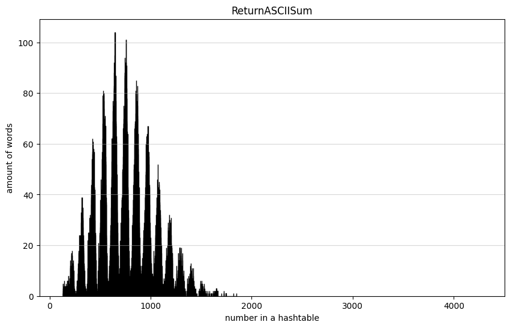

А вот так для размера 503. Дисперсия = 6.9 (но load factor уже не 7, а 61)  

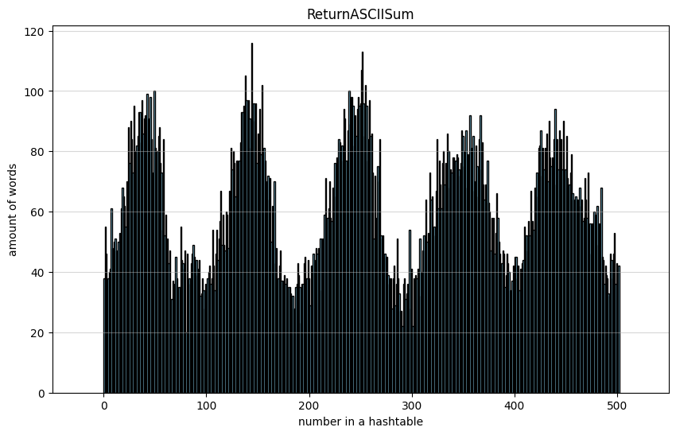

Распределение не идеальное, но на маленьких хеш-таблицах она показывает себя неплохо. И это логично, ведь длина слов ограничена, следовательно сумма ASCII-кодов не может быть больше 32 * 122 = 3904 и меньше ascii('A') = 65 (ascii('z') = 122, 32 - максимальная длина слова в нашей хеш-таблице, но, понятное дело, нормальные слова еще меньше).  

## RotateLeft()
Циклический сдвиг влево.  
```
unsigned int RotateLeft(char* word)
{
    int h = 0;
    int len = strlen(word);

    for (int i = 0; i < len; i++)
        h = RoL(h) ^ word[i];

    return h;
}

int RoL(int a) //циклический сдвиг влево
{
      int t1, t2;

      t1 = a << 1;   //двигаем а вправо на n бит, теряя старшие биты
      t2 = a >> 31; //перегоняем старшие биты в младшие

      return t1 | t2;  //объединяем старшие и младшие биты
}
```

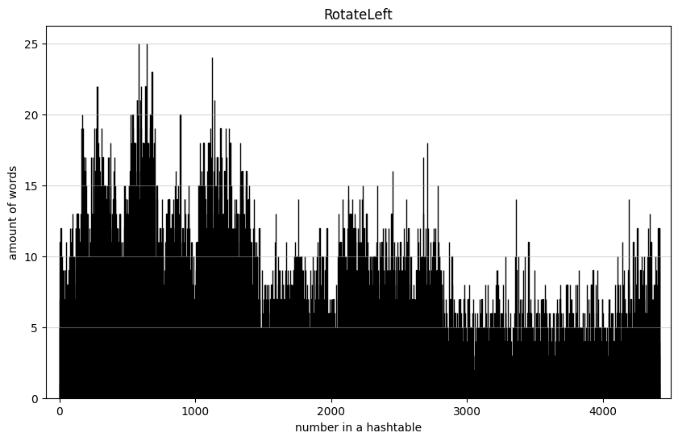

Тут уже заполнены все ячейки хеш-таблицы. Да, не совсем равномерно, видны пики и провалы, но значение дисперсии не может не радовать: 2.2  

## crc32()

```
unsigned int crc32(char* word)
{
    unsigned int crc = 0xffffffff;
    int poly = 0xedb88320;
    int len = strlen(word);

    for (int i = 0; i < len; i++)
    {
        int c = (crc ^ word[i]) & 0xff;
        for (int k = 0; k < 8; k++)
            c = (c & 1) != 0 ? poly ^ (c >> 1) : c >> 1;
        crc = c ^ (crc >> 8);
    }

    return crc ^ 0xffffffff;
}
```

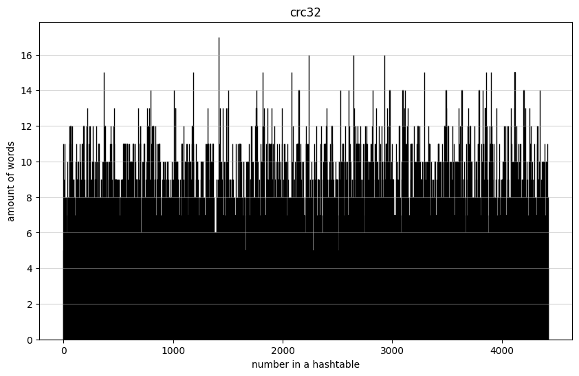

Распределение - просто прелесть, все ячейки заполнены, слова равномерно распределены по всей хеш-таблице. Дисперсия = 1  

В итоге:  

хеш-функция                     | D
--------------------------------|-------
Return0                         | 31500
ReturnLenOfWord                 | 3471
FirstLetterOfWord               | 1156
ReturnASCIISum (большая хт)     | 37
ReturnASCIISum (маленькая хт)   | 6.9
RotateLeft                      | 2.2
crc32                           | 1.0

Вывод прост: к выбору хеш-функции надо подходить с умом. Return0 показала себя хуже всех, а crc32 хорошо подходит для использования в хеш-таблицах.  

## Оптимизация

Целью данной части работы является использование оптимизаций трех видов: intrinsic функции, ассемблерная вставка, внешний ассемблер.  
При оценке оптимизации использовался valgrind и замер тактов процессора. (Изначально использовалась функция clock_gettime(), но по этим измерениям не было видно изменений при оптимизации, поэтому был совершен переход на более точный инструмент: __rdtsc())  
Поехали!  
Начальный замер тактов:  
№ | значение
--|---------
1 | 13594064052
2 | 9625317116
3 | 9444003083
4 | 10383661170
5 | 10913798216

Среднее: $107.9 \cdot 10^8$  
Итак, вот такую картинку выдал valgrind при профилировании программы в первый раз:  

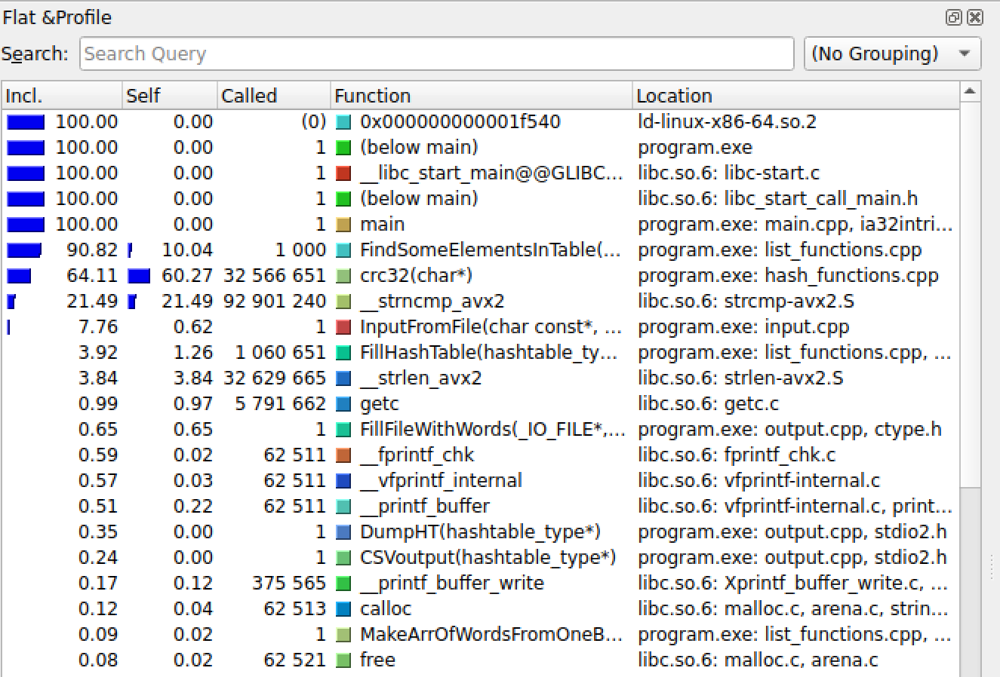

Будем оптимизировать crc32:  

```
unsigned int crc32Optimized(char* word)
{
    uint32_t crc = 0xffffffff;

    for (int i = 0; i < MAX_LEN_OF_WORD / 8; i++)
        crc = _mm_crc32_u64(crc, *((uint64_t*)word + i)); 

    return crc;
}
```

Удобно, о нас уже позаботились и придумали intrinsic функцию: _mm_crc32_u64(unsigned __int64 crc, unsigned __int64 v), она обрабатывает 8 букв слова за раз. Так сложились обстоятельства, что максимальная длина слова равна 32, то есть надо пропустить слово через данную intrinsic функцию 4 раза, что и делает оптимизированная версия.  
Что же произошло с производительностью программы?  

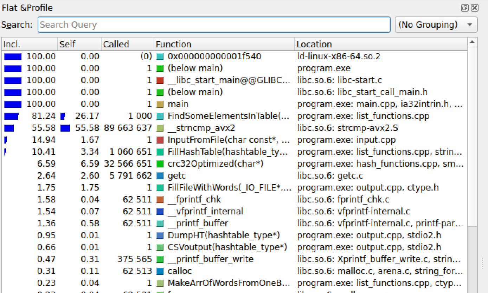

Замер тактов:
№ | значение
--|---------
1 | 7964220607
2 | 6335482206
3 | 5439692405
4 | 5681707945
5 | 8578895666

Среднее: $68.0 \cdot 10^8$  

Результат на лицо, количество тактов сократилось в 1.6 раза.  
Теперь будем оптимизировать strncmp().  

```
int MyStrcmp(char* word1, char* word2)
{
    int result = 0;

__asm__ 
(
    ".intel_syntax noprefix\n\t"

    "xor rax, rax\n\t"
    "vmovups ymm0, [%1]\n\t"   
    "vmovups ymm1, [%2]\n\t"      
    "vptest  ymm0, ymm1\n\t"      
    "setnb al\n\t"
    "mov %0, eax\n\t"

    ".att_syntax prefix\n\t"
    :"+&r"(result)                     //список выходных параметров.
    :"r"(word1), "r"(word2)            //список входных параметров.
    :"ymm0", "ymm1", "rax"             //список разрушаемых регистров.
);
}
```

Опять удачно выбранная максимальная длина слова помогла определиться с оптимизацией: регистры ymm вмещают в себя 256 бит, каждый символ занимает 8 бит, а максимальная длина слова равна 32. Так удобно слово ложится в такой регистр, воспользовавшись этим и была написана ассемблерная вставка MyStrcmp().  
Стоит сделать оговорку, что моя функция сравнения строк возвращает только либо 0 (в случае равенства строк), либо 1 (иначе). Но для данной задачи этого вполне хватит, не имеет смысла выводить разность ASCII-кодов.  
Вновь посмотрим на измерения:  

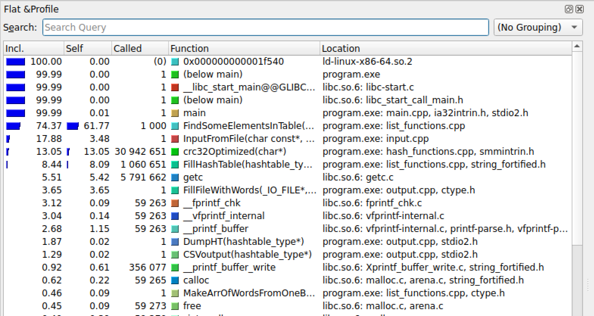

Замер тактов:
№ | значение
--|---------
1 | 4860180174
2 | 3443016002
3 | 3083650248
4 | 3572119438
5 | 3153616973

Среднее: $36.2 \cdot 10^8$  

Время уменьшилось относительно предыдущего измерения в 1.9 раз, а относительно начала - в 3 раза!!  
Так как цель - использовать все 3 инструмента для оптимизации, я проведу еще измерения для другой версии оптимизации crc32.  
Итак, теперь будем рассматривать CRC32ASM (внешний ассемблер):  

```
CRC32ASM:
    mov rax, -1    

    crcloop:
    mov cl, [rdi]    
    crc32 rax, cl           
    inc rdi  
    cmp cl, 0              
    jne crcloop                

    ret  
```

В ассемблере также есть готовая инструкция crc32, она последовательно обрабатывает каждую букву слова, и вот, к чему это привело:  

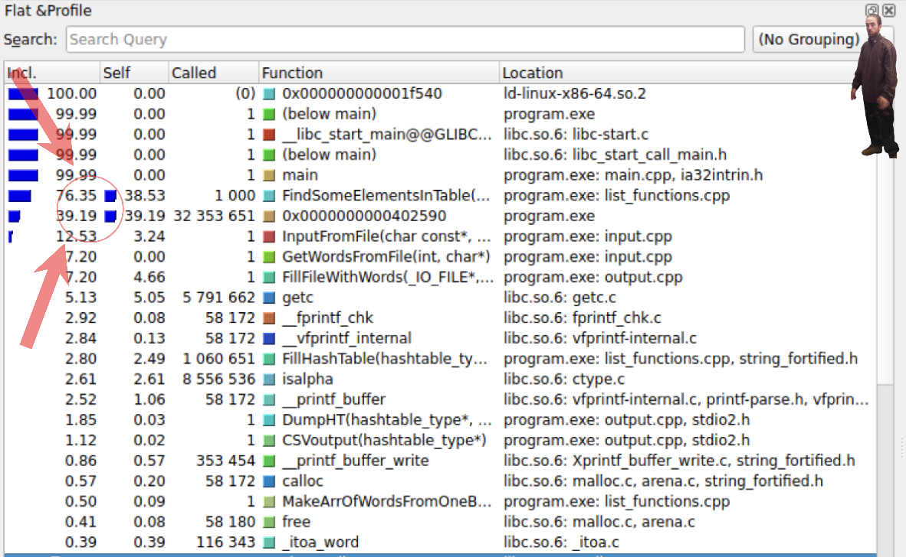

Замер тактов:
№ | значение
--|---------
1 | 2243767197
2 | 4751844727
3 | 2217354579
4 | 2213414176
5 | 2345123956

Среднее: $27.5 \cdot 10^8$  

Эта версия быстрее первоначальной почти в 4 раза!  

Прикольно, эта версия оказалась быстрее intrinsic функции. Возможно, это из-за того, что в intrinsic-версии всегда обрабатываются 32 байта, а в ассемблерной версии - по достижении нулевого символа цикл завершается, следовательно, лишних итераций нет.  

## Вывод
В этой работе были получены распределения разных хеш-функций и 3 оптимизации кода, повлиявшие на быстродействие программы.   
